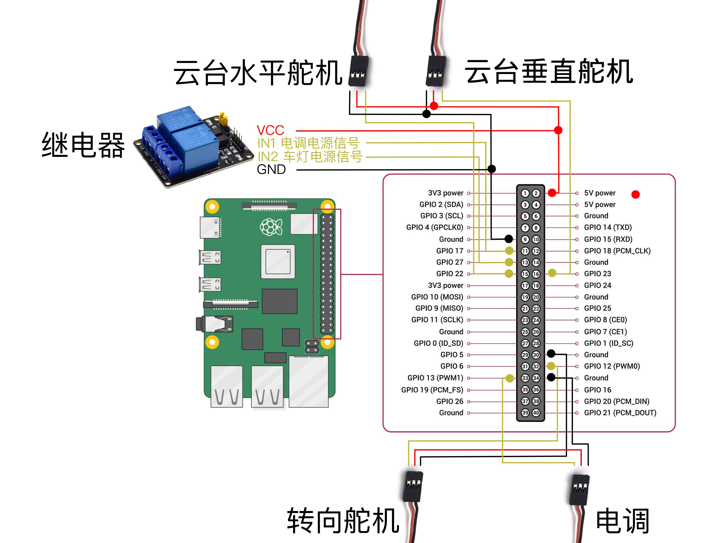

# Network RC - Remote Control Car Software For Raspberry Pi

[中文](./README-cn.md) | [Docs](https://network-rc.esonwong.com)

Network RC' feature:

- Low-latency control and network videotransmission
- 27 custom channels(PWM or Height/Low)
- Multiple cameras with adaptive resolution
- Touch, gamepad, keyboard, RC transmitter control
- Real-time listening and voice sending/two-way voice call
- Cloudflare Tunnel for remote access
- GPS positioning and track recording
- Comprehensive logging system
- Voice broadcast and audio playback
- Remote shared control
- WebRTC optimization for 4G networks

## Dependencies

- ffmpeg: Please make sure ffmpeg is installed, `sudo apt install ffmpeg -y`
- pulseaudio: `sudo apt install pulseaudio -y`
- GPS tools: `sudo apt install gpsd gpsd-clients -y`
- SQLite: `sudo apt install sqlite3 -y`
- nodejs

## Install

```bash
bash <(curl -sL https://download.esonwong.com/network-rc/install.sh)
```

## Guide

- Remould RC Car
  - Video Course: [4G 网络 RC 遥控车 02 - DIY 网络控制改造教程](https://www.bilibili.com/video/BV1iK4y1r7mD)
  - Doc Course: [WiFi 网络遥控车制作教程](https://blog.esonwong.com/WiFi-4G-5G-%E7%BD%91%E7%BB%9C%E9%81%A5%E6%8E%A7%E8%BD%A6%E5%88%B6%E4%BD%9C%E6%95%99%E7%A8%8B/)
- 4G Remote Control
  - Video Course：[4G 5G 网络 RC 遥控车 03 - 无限距离远程遥控？](https://www.bilibili.com/video/BV1Xp4y1X7fa)
  - Doc Course：[网络遥控车互联网控制教程](https://blog.esonwong.com/%E7%BD%91%E7%BB%9C%E9%81%A5%E6%8E%A7%E8%BD%A6%E4%BA%92%E8%81%94%E7%BD%91%E6%8E%A7%E5%88%B6%E6%95%99%E7%A8%8B/)

## Development

```bash
git clone https://github.com/esonwong/network-rc.git
cd network-rc/front-end
yarn # or npm install
yarn build # or npm run build
cd ..
npm install # only supports npm
node index.js
```

open `http://[your raspberry pi's ip adress]:8080`

## Circuit Diagram



## Downloads

- <https://download.esonwong.com/network-rc>

## Social Group

### Wechat Group

How to join a group: add personal WeChat account `EsonWong_`, remark `Network RC`.

### Telegram Group

[Link](https://t.me/joinchat/sOaIYYi2sJJlOWZl)

## Donate

[Paypal Donate Link](https://www.paypal.com/donate?business=27B3QGKHUM2FE&item_name=Buy+me+a+cup+of+coffee&currency_code=USD)


## Links

- [My Bilibili Home Page](https://space.bilibili.com/96740361)
- [My Youtube Home Page](https://www.youtube.com/c/itiwll)

## Credits
- Cloudflare - Providing free Tunnel service
