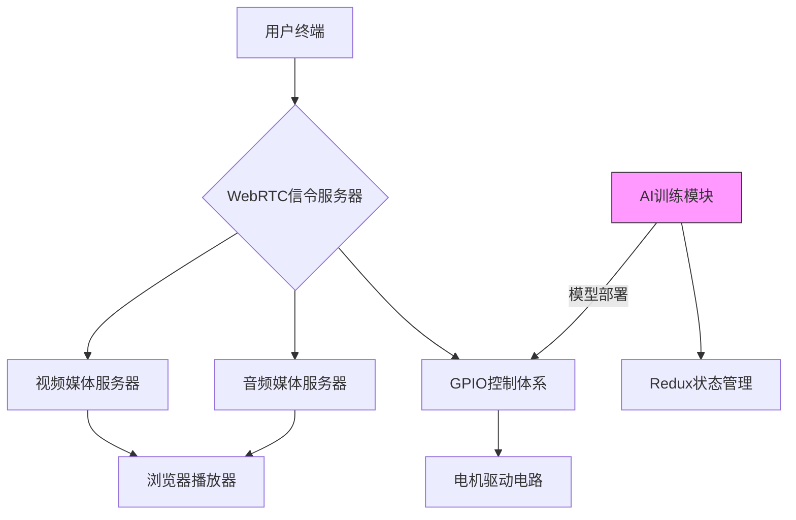
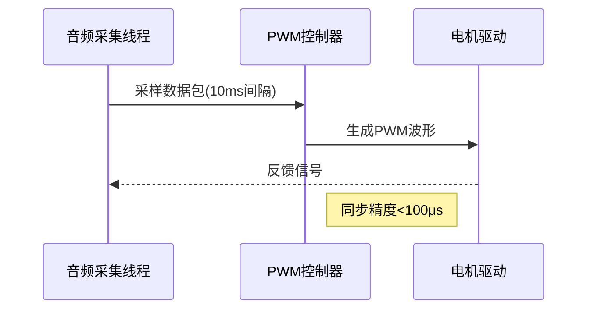
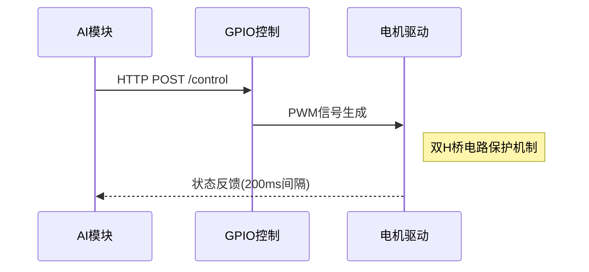

# 技术架构说明

## 系统架构


## 核心模块

## 核心模块

### GPIO控制体系
- 使用WiringPi库实现PWM信号生成
- 支持双H桥电机驱动电路
- 光电隔离保护设计

### WebRTC传输链路
1. 信令服务器：使用Socket.IO建立连接
2. 媒体服务器：实现STUN/TURN穿透
3. 自适应码率控制算法

### Redux状态管理
- 采用Ducks模式组织store
- 异步操作使用redux-thunk中间件
- 持久化存储驾驶偏好设置

## 性能指标
| 模块 | 延迟 | 吞吐量 |
|------|------|--------|
| 控制指令 | <50ms | 100msg/s |
| 视频流 | 300ms | 30fps@720p |
| 音频流 | 200ms | 48kHz |

## AI训练模块
- 使用TensorFlow.js实现迁移学习
- 支持MobileNet特征提取
- 模型导出格式：JSON+二进制权重
- 训练指标实时可视化

## 待完善部分
⚠️ AI训练模块架构图

## 音频采集与PWM控制时序


## AI训练模块部署规范
1. 模型转换要求:
   - 必须使用TensorFlow.js转换器
   - 输入尺寸需匹配224x224x3
   - 量化精度不低于8位
2. 硬件加速配置:
```bash
$ export TF_FORCE_GPU_ALLOW_GROWTH=true
$ export TF_CPP_MIN_LOG_LEVEL=2
```
3. 性能监控指标:
   - 推理延迟<300ms
   - CPU利用率<70%
   - 内存占用<1.5GB
## 接口规范

### AI模型部署接口
```rest
POST /api/v1/deploy-model
Content-Type: multipart/form-data

- 请求参数：
  - model_file: 模型文件(.zip)
  - config: 部署配置(JSON)

- 响应格式：
```json
{
  "status": "success",
  "model_id": "mobilenet_v3_2024",
  "api_endpoint": "/inference/mobilenet_v3_2024"
}
```

### 控制指令接口


## 部署规范
1. 模型文件需包含：
   - model.json (拓扑结构)
   - weights.bin (量化权重)
   - labels.txt (分类标签)
2. 硬件要求：
   - Raspberry Pi 4B+ 4GB RAM
   - 专用NPU加速模块
3. 部署流程：
```bash
$ node deploy.js --model ./mobilenet_v3 \
                 --input-shape 224x224x3
```

[//]: # (后续需要补充代码流程图)